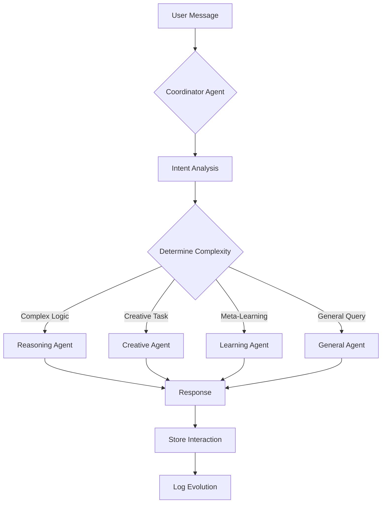

# Phase 3C: Multi-Agent Orchestration System

## Overview

Phase 3C introduces an intelligent multi-agent system that automatically routes user requests to specialized AI agents based on the nature of the task. This enables more sophisticated, context-aware responses tailored to specific problem types.

## Specialized Agents

### 1. **Coordinator Agent** (`coordinator-agent`)
**Role:** Intent analysis and intelligent routing

**Capabilities:**
- Analyzes user messages to determine intent
- Recommends the most appropriate agent(s) for the task
- Tracks complexity levels (low/medium/high)
- Logs all routing decisions for learning

**When It's Used:** Automatically invoked on every request (unless agent is manually specified)

**Example Routing Decisions:**
```json
{
  "intent": "solve complex math problem",
  "complexity": "high",
  "recommended_agents": ["reasoning"],
  "requires_coordination": false
}
```

### 2. **Reasoning Agent** (`reasoning-agent`)
**Role:** Deep logical analysis and problem-solving

**Capabilities:**
- Multi-step reasoning with chain-of-thought
- Mathematical and logical problem solving
- Step-by-step analysis and verification
- Structured problem decomposition

**Best For:**
- Complex logical problems
- Mathematical calculations
- Step-by-step tutorials
- Analytical tasks requiring verification

**Example Usage:**
```typescript
const result = await supabase.functions.invoke('reasoning-agent', {
  body: { 
    problem: "How do I optimize a recursive fibonacci function?"
  }
});
```

### 3. **Creative Agent** (`creative-agent`)
**Role:** Ideation and innovative problem-solving

**Capabilities:**
- Divergent thinking and brainstorming
- Analogical reasoning
- Novel solution generation
- SCAMPER method application

**Best For:**
- Brainstorming sessions
- Creative problem-solving
- Generating multiple ideas
- Exploring unconventional approaches

**Temperature:** 0.9 (higher for more creativity)

**Example Usage:**
```typescript
const result = await supabase.functions.invoke('creative-agent', {
  body: { 
    messages: [{ role: 'user', content: 'Give me 10 unique app ideas for productivity' }]
  }
});
```

### 4. **Learning Agent** (`learning-agent`)
**Role:** Meta-learning and pattern analysis

**Capabilities:**
- Analyzes interaction patterns
- Identifies knowledge gaps
- Suggests system improvements
- Meta-learning (learning about learning)

**Best For:**
- Understanding learning patterns
- Identifying what to improve
- Analyzing conversation history
- System capability recommendations

**Context Used:**
- All stored memories (up to 50)
- Knowledge base entries (top 30)
- Recent interactions (last 20)
- User satisfaction metrics

**Example Usage:**
```typescript
const result = await supabase.functions.invoke('learning-agent', {
  body: { 
    messages: [{ role: 'user', content: 'What patterns do you see in my questions?' }]
  }
});
```

### 5. **General Agent** (default `chat-stream`)
**Role:** Standard conversational AI

**Capabilities:**
- General conversation
- Simple questions and answers
- Context-aware responses using memories
- Adaptive behavior application

**Best For:**
- Casual conversation
- Simple queries
- General assistance
- Default fallback

## How Agent Routing Works



## Implementation Details

### 1. Automatic Routing (Default)

When using `chat-stream-with-routing`, the system:

1. **Analyzes** the user message via coordinator
2. **Routes** to the most appropriate agent
3. **Executes** the specialized agent logic
4. **Logs** the routing decision and metrics
5. **Returns** the response with metadata

### 2. Manual Agent Selection

You can force a specific agent:

```typescript
const result = await supabase.functions.invoke('chat-stream-with-routing', {
  body: {
    messages: [...],
    forceAgent: 'reasoning' // or 'creative', 'learning', 'general'
  }
});
```

### 3. Agent Context

Each agent receives:
- User message history
- Session ID
- User-specific context (memories, behaviors, capabilities)
- Authorization token

### 4. Response Metadata

All responses include:
```typescript
{
  response: "...", // The actual response text
  agent: "reasoning", // Which agent was used
  analysis: { // Coordinator's analysis
    intent: "...",
    complexity: "high",
    recommended_agents: ["reasoning"]
  }
}
```

## Evolution Tracking

All agent invocations are logged in `evolution_logs`:

```sql
SELECT * FROM evolution_logs 
WHERE log_type IN ('agent_coordination', 'deep_reasoning', 'creative_ideation', 'learning_analysis')
ORDER BY created_at DESC;
```

**Metrics Tracked:**
- Agent selection decisions
- Complexity levels
- Success rates
- Context usage
- Response quality

## UI Integration

### Agent Selector Component

The `AgentSelector` component allows manual agent selection:

```tsx
import { AgentSelector } from "@/components/AgentSelector";

<AgentSelector 
  selectedAgent={agent}
  onSelectAgent={setAgent}
/>
```

### Evolution Dashboard

View agent statistics and routing history in the Evolution Dashboard:
- Multi-Agent System card showing all 4 agents
- Usage statistics per agent type
- Routing success rates
- Performance metrics

## Performance Characteristics

| Agent | Avg Response Time | Temperature | Complexity Handling |
|-------|------------------|-------------|---------------------|
| Coordinator | ~1-2s | 0.3 | Intent analysis |
| Reasoning | ~5-10s | 0.7 | High complexity |
| Creative | ~3-7s | 0.9 | Variable |
| Learning | ~4-8s | 0.7 | Historical analysis |
| General | ~2-5s | 0.7 | Low-medium |

## Future Enhancements (Phase 3D)

- **Multi-agent coordination:** Route requests to multiple agents simultaneously
- **Agent voting:** Synthesize responses from multiple perspectives
- **Dynamic agent creation:** Generate new specialized agents on-demand
- **Agent learning:** Agents learn from each other's responses
- **Performance optimization:** Agent caching and response memoization

## Configuration

All agents are configured in `supabase/config.toml`:

```toml
[functions.coordinator-agent]
verify_jwt = true

[functions.reasoning-agent]
verify_jwt = false  # Can be used without auth for testing

[functions.creative-agent]
verify_jwt = true

[functions.learning-agent]
verify_jwt = true
```

## Testing

### Test Coordinator Routing:

```bash
curl -X POST https://your-project.supabase.co/functions/v1/coordinator-agent \
  -H "Authorization: Bearer YOUR_TOKEN" \
  -H "Content-Type: application/json" \
  -d '{"message": "Solve: 2x + 5 = 17"}'
```

### Test Reasoning Agent:

```bash
curl -X POST https://your-project.supabase.co/functions/v1/reasoning-agent \
  -H "Content-Type: application/json" \
  -d '{"problem": "What is the optimal algorithm for sorting 1 million integers?"}'
```

## Success Metrics

✅ **Phase 3C Complete When:**
- All 4 specialized agents deployed and functional
- Coordinator accurately routes requests (>85% accuracy)
- Agent responses are logged and tracked
- Evolution dashboard shows agent statistics
- UI allows manual agent selection

## Troubleshooting

**Issue:** Coordinator always returns "general" agent
- **Solution:** Check the intent analysis prompt and temperature settings

**Issue:** Reasoning agent times out
- **Solution:** Complex problems may need longer timeouts; consider breaking into smaller steps

**Issue:** Learning agent has no context
- **Solution:** Ensure user has interactions and memories in the database

---

**Phase 3C Status:** ✅ Implemented
**Next Phase:** 3D - Autonomous Evolution & Self-Improvement
